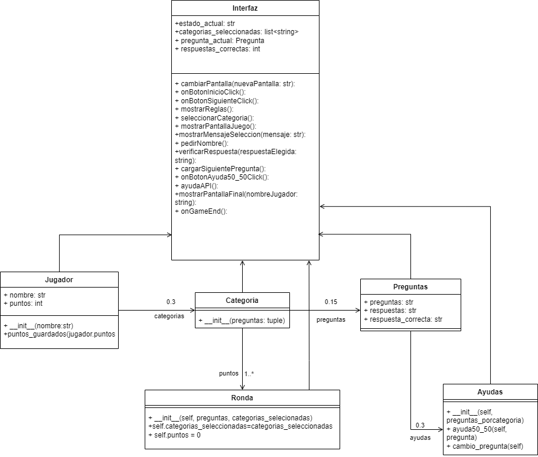

# Triviathon: Un juego de preguntas desafiante y atractivo.

En el juego "Triviathon", los jugadores deberán elegir entre 1 y 3 categorías de las 8 disponibles: Historia, Arte, Cultura Pop, Ciencia y Tecnología, Geografía, Deportes, Entretenimiento y Ciencia Ficción. Cada categoría cuenta con 5 preguntas, y por cada respuesta correcta, el jugador suma un punto. Sin embargo, si se equivoca en alguna pregunta, la ronda llega a su fin.
Para comenzar, los usuarios deben registrarse con el nombre de su elección y luego seleccionar las categorías en las que desean poner a prueba su conocimiento.

Durante la ronda, los jugadores disponen de 3 opciones de ayuda: 1. "50/50", que reduce las opciones de respuesta de 4 a 2; 2. "Cambio de pregunta", que reemplaza la pregunta actual por una nueva; y 3. "Texto de IA" (no disponible actualmente), donde se muestra un texto relacionado con la pregunta que contiene la respuesta implícita y el jugador debe interpretarla.

Si el jugador elige una sola categoría, solo podrá utilizar una ayuda en toda la ronda. Si opta por 2 categorías, tendrá acceso a 2 ayudas, y si selecciona 3 categorías, podrá utilizar las 3 ayudas disponibles. Las ayudas se utilizan en el orden elegido por el jugador y una vez agotadas, quedan bloqueadas.

En caso de escoger 2 o 3 categorías, el jugador tendrá la opción de continuar jugando hasta responder todas las preguntas o retirarse cada vez que haya respondido 6 preguntas. Si decide retirarse, la ronda finaliza; de lo contrario, la ronda continúa.

El jugador tiene la opción de jugar hasta 3 rondas si así lo desea. Una vez que una ronda finaliza, se le da al jugador la opción de continuar a la siguiente ronda o finalizar el juego. Si decide continuar a la siguiente ronda, deberá escoger nuevamente entre 1 y 3 categorías, las cuales no pueden repetirse con las categorías de la ronda anterior. Al finalizar el juego, se muestra al jugador las rondas que jugó, los puntos obtenidos y las categorías elegidas en cada ronda.

